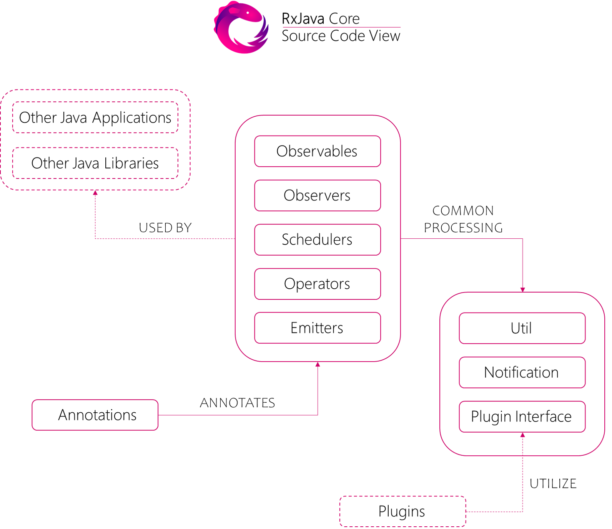
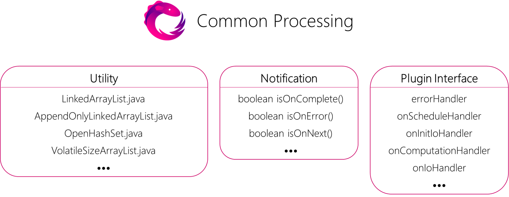

# 目录

- [进度报告(截至第9周) 文天阳 2017302580087](#进度报告截至第9周-文天阳-2017302580087)
- [进度报告(截至第5周) 张心蕊 2017302580089](#进度报告截至第5周-张心蕊-2017302580089)
- [进度报告(截至第9周) 章成凯 2017302580093](#进度报告截至第9周-章成凯-2017302580093)
- [进度报告(截至第12周) 胡思成 2017302580096](#进度报告截至第12周-胡思成-2017302580096)

# 进度报告(截至第9周) 文天阳 2017302580087
## Step 1 - Learn about RxJava and write the Introduction part
### A preliminary understanding of the basic functions and basic usage of RxJava
* RxJava – Reactive Extensions for the JVM – a library for composing asynchronous and event-based programs using observable sequences for the Java VM. ReactiveX is a library for composing asynchronous and event-based programs by using observable sequences.
* It extends the observer pattern to support sequences of data and/or events and adds operators that allow you to compose sequences together declaratively while abstracting away concerns about things like low-level threading, synchronization, thread-safety, concurrent data structures, and non-blocking I/O. 

#### Tutorials Used
- [RxJava official doc](https://mcxiaoke.gitbooks.io/rxdocs/content/)
- [The summary of RxJava](https://blog.csdn.net/jthou20121212/article/details/82960323)
- [Android 高级开发——响应式编程框架 RxJava2 解析](https://www.cnblogs.com/smartbetter/p/7723773.html)

### Understand the origins and evolution of RxJava

#### Tutorials Used
- [RxJava1.x的诞生](https://blog.csdn.net/zcbcba123/article/details/86758482)
- [RxJava使用简史](https://blog.csdn.net/piaixue/article/details/78123991)

### Understand the RxJava development team

#### Tutorials Used
- [Introduction to Rx](http://introtorx.com/)
## Step 2 - Stakeholder analysis of RxJava and write the Stakeholder analysis part
### Stakeholder analysis
* This section identifies the key stakeholders of RxJava and describes how they apply to the project.
### Power/Interest Grid
* Use tools to draw Power/Interest grid.
#### Tutorials Used
- [How to do stakeholder analysis well](http://ishare.iask.sina.com.cn/f/32QKUskuE2i.html)
## Step 3 - Learn and submit reports using GitHub
### Install and configure Git bash

```
$ git config --global user.name "w1009296924"
$ git config --global user.email "1009296924@qq.com"
$ git config --global --list
$ ssh -T git@github.com
```
#### Tutorials Used
- [How to use Git](https://blog.csdn.net/huangqqdy/article/details/83032408)
### Download and submit reports
```
$ git clone https://github.com/zhangchengkai826/RxJava.git
$ git checkout sa-progress
$ git add -A
$ git commit -m "..."
$ git fetch
$ git rebase origin/sa-progress
$ git push -u origin sa-progress
```
#### Tutorials Used
- [Github tutorial](https://www.runoob.com/w3cnote/git-guide.html)

## Step 4 - Do some fix of the Power Interest Grid part
* Analysis is carried out through the table, and corresponding analysis results are added, including thepower/interest of various stakeholders in RxJava.

## Step 5 - Modify the introduction section
* According to the recommendation of the teaching assistant, some modifications are made to the introduction to make it more accurate.

## Step 6 - Write the Critical to Quality Attributes part in the report
* This section will focus on analyzing RxJava's critical to quality attributes from the perspective of various stakeholders and identifying the most important quality attributes for the project.

# 进度报告(截至第5周) 张心蕊 2017302580089
## Step 1. Read the official document and learn about RxJava

(Below are some learning notes)
RxJava is a extension of ReactiveX based on Java:
- Extended observer mode
- Support data\event sequence
- Provide operators to group sequences together in a declarative manner
- Internal processing of threads, synchronization, thread safety and concurrent data structures
    ReactiveX provides **responsive programming for a variety of programming languages** (observer mode, Iterator mode, functional mode)
	Responsive programming: A scenario in which a program reacts when data appears (based on events)
	Functional programming: building software with pure functionality

Key components:
	**observables**: Can send zero or more data and control speed
	**observer**: Observe the observable, react to the outgoing data, process the data

## Step 2. Learn How to Use RxJava

## Step 3. Read the Source Code

   Reading the source directly is difficult, so I just read some blogs to get started. And the schedule is kind of slow.
## Step 4. Write the Evolution Perspective

   The evolution of RxJava are behind the source code with some documents. Without finishing the source code, I read some significant  documents to summarize the evolution. It must has some problems, but it helps me main development of RxJava. And I will revise with my reading.
   
## Step 5. Write the Information View

After learning more about RxJava, I continue to write the information part. But as I learned the information view  describes the way that the system stores, manipulates, manages, and distributes information, which is a little not suitable for our project. For this is always suitable for a information system, which has many data to transform or store. But the RxJava is just a Library, not an independent system. So in this part, I analyze the very important part of RxJava--Data Flow, which is related to it in some way.

# 进度报告(截至第9周) 章成凯 2017302580093

## First Step - Learn to Use RxJava

### Build RxJava from Source Using Gradle

```
$ git clone git@github.com:ReactiveX/RxJava.git
$ cd RxJava/
$ ./gradlew build
```

#### Learn to Use Gradle

##### Tutorials Used

- [Creating New Gradle Builds](https://guides.gradle.org/creating-new-gradle-builds/)

##### Problems Met

```
%USERPROFILE%\Desktop\experiment\gradle\basic-demo>gradle init

Welcome to Gradle 5.4.1!

Here are the highlights of this release:
 - Run builds with JDK12
 - New API for Incremental Tasks
 - Updates to native projects, including Swift 5 support

For more details see https://docs.gradle.org/5.4.1/release-notes.html

Starting a Gradle Daemon (subsequent builds will be faster)

Select type of project to generate:
  1: basic
  2: cpp-application
  3: cpp-library
  4: groovy-application
  5: groovy-library
  6: java-application
  7: java-library
  8: kotlin-application
  9: kotlin-library
  10: scala-library
Enter selection (default: basic) [1..10] 1

Select build script DSL:
  1: groovy
  2: kotlin
Enter selection (default: groovy) [1..2] 1

Project name (default: basic-demo):

BUILD SUCCESSFUL in 1m 0s
2 actionable tasks: 2 executed
%USERPROFILE%\Desktop\experiment\gradle\basic-demo>gradlew copy
Downloading https://services.gradle.org/distributions/gradle-5.4.1-bin.zip

Exception in thread "main" java.net.SocketException: Unexpected end of file from server
        at sun.net.www.http.HttpClient.parseHTTPHeader(HttpClient.java:851)
        at sun.net.www.http.HttpClient.parseHTTP(HttpClient.java:678)
        at sun.net.www.protocol.http.HttpURLConnection.doTunneling(HttpURLConnection.java:2055)
        at sun.net.www.protocol.https.AbstractDelegateHttpsURLConnection.connect(AbstractDelegateHttpsURLConnection.java:183)
        at sun.net.www.protocol.http.HttpURLConnection.getInputStream0(HttpURLConnection.java:1564)
        at sun.net.www.protocol.http.HttpURLConnection.getInputStream(HttpURLConnection.java:1492)
        at sun.net.www.protocol.https.HttpsURLConnectionImpl.getInputStream(HttpsURLConnectionImpl.java:263)
        at org.gradle.wrapper.Download.downloadInternal(Download.java:67)
        at org.gradle.wrapper.Download.download(Download.java:52)
        at org.gradle.wrapper.Install$1.call(Install.java:62)
        at org.gradle.wrapper.Install$1.call(Install.java:48)
        at org.gradle.wrapper.ExclusiveFileAccessManager.access(ExclusiveFileAccessManager.java:69)
        at org.gradle.wrapper.Install.createDist(Install.java:48)
        at org.gradle.wrapper.WrapperExecutor.execute(WrapperExecutor.java:107)
        at org.gradle.wrapper.GradleWrapperMain.main(GradleWrapperMain.java:63)
```

##### Solutions Tried

- [Set gradle proxy to socks](https://discuss.gradle.org/t/how-can-i-set-gradle-proxy-to-socks/15508) **SOLVED**

Add those lines to %USERPROFILE%\\.gradle\\gradle.properties

```
org.gradle.jvmargs=-DsocksProxyHost=127.0.0.1 -DsocksProxyPort=1080

systemProp.http.proxyHost=socks5://127.0.0.1
systemProp.http.proxyPort=1080

systemProp.https.proxyHost=socks5://127.0.0.1
systemProp.https.proxyPort=1080
```

##### Tutorials Used

- [Building Java Libraries](https://guides.gradle.org/building-java-libraries/)
- [A beginners guide to Gradle](https://medium.com/@andrewMacmurray/a-beginners-guide-to-gradle-26212ddcafa8) **INFORMATIVE**

##### Problems Met

```
%USERPROFILE%\Desktop\experiment\gradle\java-lib-demo>gradle init

Select type of project to generate:
  1: basic
  2: cpp-application
  3: cpp-library
  4: groovy-application
  5: groovy-library
  6: java-application
  7: java-library
  8: kotlin-application
  9: kotlin-library
  10: scala-library
Enter selection (default: basic) [1..10] 7

Select build script DSL:
  1: groovy
  2: kotlin
Enter selection (default: groovy) [1..2] 1

Select test framework:
  1: junit
  2: testng
  3: spock
Enter selection (default: junit) [1..3] 1

Project name (default: java-lib-demo):
Source package (default: java.lib.demo): demo.zck

BUILD SUCCESSFUL in 1m 30s
2 actionable tasks: 2 executed
%USERPROFILE%\Desktop\experiment\gradle\java-lib-demo>gradlew build
> Task :compileJava FAILED

FAILURE: Build failed with an exception.

* What went wrong:
Execution failed for task ':compileJava'.
> Could not resolve all files for configuration ':compileClasspath'.
   > Could not resolve org.apache.commons:commons-math3:3.6.1.
     Required by:
         project :
      > Could not resolve org.apache.commons:commons-math3:3.6.1.
         > Could not get resource 'https://jcenter.bintray.com/org/apache/commons/commons-math3/3.6.1/commons-math3-3.6.1.pom'.
            > Could not GET 'https://jcenter.bintray.com/org/apache/commons/commons-math3/3.6.1/commons-math3-3.6.1.pom'.
               > socks5://127.0.0.1

* Try:
Run with --stacktrace option to get the stack trace. Run with --info or --debug option to get more log output. Run with --scan to get full insights.

* Get more help at https://help.gradle.org

BUILD FAILED in 1s
1 actionable task: 1 executed
```

##### Solutions Tried

- [Set JVM proxy to socks](https://stackoverflow.com/questions/37822473/jmeter-with-socks-proxy) **SOLVED**

Delete those lines to %USERPROFILE%\\.gradle\\gradle.properties

```
systemProp.http.proxyHost=socks5://127.0.0.1
systemProp.http.proxyPort=1080

systemProp.https.proxyHost=socks5://127.0.0.1
systemProp.https.proxyPort=1080
```

##### Tutorials Used

- [Publish gradle java library to JCenter](https://medium.com/@yegor_zatsepin/simple-way-to-publish-your-android-library-to-jcenter-d1e145bacf13) **INFORMATIVE**

##### References

- [Gradle: What is the difference between classpath and compile dependencies?](https://stackoverflow.com/questions/34286407/gradle-what-is-the-difference-between-classpath-and-compile-dependencies)
- [What the difference in applying gradle plugin](https://stackoverflow.com/questions/32352816/what-the-difference-in-applying-gradle-plugin)
- [ext and code block's meaning in the gradle file](https://stackoverflow.com/questions/21696534/ext-and-code-blocks-meaning-in-the-gradle-file)

#### Read & Try to Understand RxJava's Build Script (build.gradle)

##### References

- [ext](https://docs.gradle.org/current/dsl/org.gradle.api.Project.html#N150E3)
- [animalsniffer](https://www.mojohaus.org/animal-sniffer/)
- [jmh](http://tutorials.jenkov.com/java-performance/jmh.html)
- [Difference between SCM and SVN](https://stackoverflow.com/questions/5872136/difference-between-scm-and-svn)
- [Implementation Vs Api](https://medium.com/mindorks/implementation-vs-api-in-gradle-3-0-494c817a6fa)

### Learn Some Basic Concepts in RxJava

- [RxJava README](https://github.com/ReactiveX/RxJava) **INFORMATIVE**
- [RxJava Tutorial](https://www.tutorialspoint.com/rxjava/index.htm)
- [Disposable](https://medium.com/@vanniktech/rxjava-2-disposable-under-the-hood-f842d2373e64)
- [FlatMap](http://reactivex.io/documentation/operators/flatmap.html)
- [Difference between Observable.create() and Observable.fromCallable()](https://stackoverflow.com/questions/43785961/difference-between-observable-create-and-observable-fromcallable)
- [Schedulers](https://www.aanandshekharroy.com/articles/2018-01/rxjava-schedulers)
- [doOnNext vs. doOnEach](https://stackoverflow.com/questions/28723341/rxjava-difference-between-doonnext-and-dooneach)
- [subscribeOn vs. observeOn](https://proandroiddev.com/understanding-rxjava-subscribeon-and-observeon-744b0c6a41ea) **INFORMATIVE**
- [flatMap() vs. concatMap() vs. concatMapEager()](https://www.nurkiewicz.com/2017/08/flatmap-vs-concatmap-vs-concatmapeager.html) **INFORMATIVE**
- [flatMap() vs. parallel()](https://www.nurkiewicz.com/2017/09/idiomatic-concurrency-flatmap-vs.html) **INFORMATIVE**
- [blockingSubscribe()](https://stackoverflow.com/questions/44658357/rxjava-scheduler-to-observe-on-main-thread)
- [flatMapSingle()](http://reactivex.io/RxJava/javadoc/io/reactivex/Observable.html#flatMapSingle-io.reactivex.functions.Function-)
- [flatMapIterable()](https://medium.com/@ubuntudroid/rxjava-flattening-a-stream-of-iterables-ea26f593ba07)
- [IgnoreElements()](http://reactivex.io/documentation/operators/ignoreelements.html)
- [andThen()](http://reactivex.io/RxJava/javadoc/io/reactivex/Completable.html#andThen-io.reactivex.ObservableSource-)

## Second Step - Read the Source Code of RxJava

### References

- [Java Anotations](https://beginnersbook.com/2014/09/java-annotations/)

### Draw the Module Structure View of RxJava


### Draw a More Detailed View at the Source Code of RxJava Core



### Write the Development View in the Final Report

- [Link](https://github.com/zhangchengkai826/RxJava/blob/sa-progress/%E7%AC%AC6%E7%BB%84-%E9%A1%B9%E7%9B%AE%E6%8A%A5%E5%91%8A.md#development-view)

### Draw a More Detailed View for the Common Processing part of RxJava



### Draw a More Detailed View for the Design Patterns used by RxJava


### Improve the Common Processing section in the Final Report

- [Link](https://github.com/zhangchengkai826/RxJava/blob/sa-progress/%E7%AC%AC6%E7%BB%84-%E9%A1%B9%E7%9B%AE%E6%8A%A5%E5%91%8A.md#common-processing)

### Improve the Standardization of Design section in the Final Report

- [Link](https://github.com/zhangchengkai826/RxJava/blob/sa-progress/%E7%AC%AC6%E7%BB%84-%E9%A1%B9%E7%9B%AE%E6%8A%A5%E5%91%8A.md#standardization-of-design)

### Run all the tests for RxJava on Windows Verion 10.0.17763 with Java 1.8 Update 191

#### Command

```
$ gradlew test
```

#### Result


### Write the Standardization of Testing section in the Final Report

- [Link](https://github.com/zhangchengkai826/RxJava/blob/sa-progress/%E7%AC%AC6%E7%BB%84-%E9%A1%B9%E7%9B%AE%E6%8A%A5%E5%91%8A.md#standardization-of-testing)


### Use SonarQube to Analyse the Technical Debt of RxJava

#### Install SonarQube

- Download Free & Open Source `SonarQube Community Edition` from [Download | SonarCube](https://www.sonarqube.org/downloads/)

- Unzip the downloaded `sonarqube-8.0.zip`

- Start the `SonarQube Server`
    - On Window x64, execute `bin/windows-x86-64/StartSonar.bat`

#### Tutorial Used

- [SonarQube|Get Started](https://docs.sonarqube.org/latest/setup/get-started-2-minutes/)

##### Problems Met

```
wrapper  | --> Wrapper Started as Console
wrapper  | Launching a JVM...
jvm 1    | Wrapper (Version 3.2.3) http://wrapper.tanukisoftware.org
jvm 1    |   Copyright 1999-2006 Tanuki Software, Inc.  All Rights Reserved.
jvm 1    |
jvm 1    |
jvm 1    | WrapperSimpleApp: Encountered an error running main: java.lang.IllegalStateException: SonarQube requires Java 11+ to run
jvm 1    | java.lang.IllegalStateException: SonarQube requires Java 11+ to run
jvm 1    |      at org.sonar.application.App.checkJavaVersion(App.java:93)
jvm 1    |      at org.sonar.application.App.start(App.java:56)
jvm 1    |      at org.sonar.application.App.main(App.java:98)
jvm 1    |      at sun.reflect.NativeMethodAccessorImpl.invoke0(Native Method)
jvm 1    |      at sun.reflect.NativeMethodAccessorImpl.invoke(NativeMethodAccessorImpl.java:62)
jvm 1    |      at sun.reflect.DelegatingMethodAccessorImpl.invoke(DelegatingMethodAccessorImpl.java:43)
jvm 1    |      at java.lang.reflect.Method.invoke(Method.java:498)
jvm 1    |      at org.tanukisoftware.wrapper.WrapperSimpleApp.run(WrapperSimpleApp.java:240)
jvm 1    |      at java.lang.Thread.run(Thread.java:748)
wrapper  | <-- Wrapper Stopped
```

##### Solutions Tried

- Create Oracle Account at [Oracle | Create Account](https://profile.oracle.com/myprofile/account/create-account.jspx)

- Install JDK 11 from [Java SE Development Kit 11 - Downloads](https://www.oracle.com/technetwork/java/javase/downloads/jdk11-downloads-5066655.html)

- Add JDK bin folder to System PATH

**SOLVED**

###### Correct Output

```
wrapper  | --> Wrapper Started as Console
wrapper  | Launching a JVM...
jvm 1    | Wrapper (Version 3.2.3) http://wrapper.tanukisoftware.org
jvm 1    |   Copyright 1999-2006 Tanuki Software, Inc.  All Rights Reserved.
jvm 1    |
jvm 1    | INFO  app[][o.s.a.AppFileSystem] Cleaning or creating temp directory %USERPROFILE%\software\sonarqube-8.0\temp
jvm 1    | INFO  app[][o.s.a.es.EsSettings] Elasticsearch listening on /127.0.0.1:9001
jvm 1    | INFO  app[][o.s.a.ProcessLauncherImpl] Launch process[[key='es', ipcIndex=1, logFilenamePrefix=es]] from [%USERPROFILE%\software\sonarqube-8.0\elasticsearch]: %USERPROFILE%\software\jdk-11.0.5\bin\java -XX:+UseConcMarkSweepGC -XX:CMSInitiatingOccupancyFraction=75 -XX:+UseCMSInitiatingOccupancyOnly -Des.networkaddress.cache.ttl=60 -Des.networkaddress.cache.negative.ttl=10 -XX:+AlwaysPreTouch -Xss1m -Djava.awt.headless=true -Dfile.encoding=UTF-8 -Djna.nosys=true -XX:-OmitStackTraceInFastThrow -Dio.netty.noUnsafe=true -Dio.netty.noKeySetOptimization=true -Dio.netty.recycler.maxCapacityPerThread=0 -Dlog4j.shutdownHookEnabled=false -Dlog4j2.disable.jmx=true -Djava.io.tmpdir=%USERPROFILE%\software\sonarqube-8.0\temp -XX:ErrorFile=../logs/es_hs_err_pid%p.log -Xmx512m -Xms512m -XX:+HeapDumpOnOutOfMemoryError -Delasticsearch -Des.path.home=%USERPROFILE%\software\sonarqube-8.0\elasticsearch -Des.path.conf=%USERPROFILE%\software\sonarqube-8.0\temp\conf\es -cp lib/* org.elasticsearch.bootstrap.Elasticsearch
jvm 1    | INFO  app[][o.s.a.SchedulerImpl] Waiting for Elasticsearch to be up and running
jvm 1    | Java HotSpot(TM) 64-Bit Server VM warning: Option UseConcMarkSweepGC was deprecated in version 9.0 and will likely be removed in a future release.
jvm 1    | INFO  app[][o.e.p.PluginsService] no modules loaded
jvm 1    | INFO  app[][o.e.p.PluginsService] loaded plugin [org.elasticsearch.transport.Netty4Plugin]
jvm 1    | INFO  app[][o.s.a.SchedulerImpl] Process[es] is up
jvm 1    | INFO  app[][o.s.a.ProcessLauncherImpl] Launch process[[key='web', ipcIndex=2, logFilenamePrefix=web]] from [%USERPROFILE%\software\sonarqube-8.0]: %USERPROFILE%\software\jdk-11.0.5\bin\java -Djava.awt.headless=true -Dfile.encoding=UTF-8 -Djava.io.tmpdir=%USERPROFILE%\software\sonarqube-8.0\temp --add-opens=java.base/java.util=ALL-UNNAMED --add-opens=java.base/java.lang=ALL-UNNAMED --add-opens=java.base/java.io=ALL-UNNAMED --add-opens=java.rmi/sun.rmi.transport=ALL-UNNAMED -Xmx512m -Xms128m -XX:+HeapDumpOnOutOfMemoryError -Dhttp.nonProxyHosts=localhost|127.*|[::1] -cp ./lib/common/*;%USERPROFILE%\software\sonarqube-8.0\lib\jdbc\h2\h2-1.3.176.jar org.sonar.server.app.WebServer %USERPROFILE%\software\sonarqube-8.0\temp\sq-process2205349952415431219properties
jvm 1    | INFO  app[][o.s.a.SchedulerImpl] Process[web] is up
jvm 1    | INFO  app[][o.s.a.ProcessLauncherImpl] Launch process[[key='ce', ipcIndex=3, logFilenamePrefix=ce]] from [%USERPROFILE%\software\sonarqube-8.0]: %USERPROFILE%\software\jdk-11.0.5\bin\java -Djava.awt.headless=true -Dfile.encoding=UTF-8 -Djava.io.tmpdir=%USERPROFILE%\software\sonarqube-8.0\temp --add-opens=java.base/java.util=ALL-UNNAMED -Xmx512m -Xms128m -XX:+HeapDumpOnOutOfMemoryError -Dhttp.nonProxyHosts=localhost|127.*|[::1] -cp ./lib/common/*;%USERPROFILE%\software\sonarqube-8.0\lib\jdbc\h2\h2-1.3.176.jar org.sonar.ce.app.CeServer %USERPROFILE%\software\sonarqube-8.0\temp\sq-process15919483467129706372properties
jvm 1    | INFO  app[][o.s.a.SchedulerImpl] Process[ce] is up
jvm 1    | INFO  app[][o.s.a.SchedulerImpl] SonarQube is up
```

#### Use SonarQube

- Log in to [http://localhost:9000](http://localhost:9000) with System Administrator credentials (login=admin, password=admin)

- Click the `Create new project` button to create a new project named `RxJava`

- Generate an account identification token, used to identify the user when an analysis is performed

- Add following code to [build.gradle](build.gradle) Gradle build script in the root directory of RxJava repository to declare the `org.sonarqube` plugin

```
plugins {
  id "org.sonarqube" version "2.7"
}
```

- Run the following command in Command Prompt at RxJava repository's root directory

```
gradlew sonarqube -Dsonar.projectKey=RxJava -Dsonar.host.url=http://localhost:9000 -Dsonar.login=(account token)
```

##### Problems Met

```
Starting a Gradle Daemon, 1 incompatible Daemon could not be reused, use --status for details

FAILURE: Build failed with an exception.

* Where:
Build file '%USERPROFILE%\Documents\repos\RxJava\build.gradle' line: 69

* What went wrong:
Could not compile build file '%USERPROFILE%\Documents\repos\RxJava\build.gradle'.
> startup failed:
  build file '%USERPROFILE%\Documents\repos\RxJava\build.gradle': 69: only buildscript {} and other plugins {} script blocks are allowed 
before plugins {} blocks, no other statements are allowed
  
  See https://docs.gradle.org/5.6/userguide/plugins.html#sec:plugins_block for information on the plugins {} block

   @ line 69, column 1.
     plugins {
     ^

  1 error


* Try:
Run with --stacktrace option to get the stack trace. Run with --info or --debug option to get more log output. Run with --scan to get full insights.

* Get more help at https://help.gradle.org

BUILD FAILED in 3s
```

##### Solutions Tried

- Put the code below to the beginning of [build.gradle](build.gradle) build script (just after the `buildscript` block)

```
plugins {
  id "org.sonarqube" version "2.7"
}
```

**SOLVED**

###### Correct Output

```
> Configure project :
JMH: [.*me.champeau.gradle.JMHPluginExtension_Decorated@75082b0c.*]

> Task :sonarqube
SonarScanner will require Java 11+ to run starting in SonarQube 8.x

BUILD SUCCESSFUL in 4m 48s
4 actionable tasks: 1 executed, 3 up-to-date
```

#### Get Analysis Result

- Get analysis result from [http://localhost:9000/dashboard?id=RxJava](http://localhost:9000/dashboard?id=RxJava)

##### Overview


##### Technical Debt


### Write the Technical Debt section in the Final Report

- [Link](https://github.com/zhangchengkai826/RxJava/blob/sa-progress/%E7%AC%AC6%E7%BB%84-%E9%A1%B9%E7%9B%AE%E6%8A%A5%E5%91%8A.md#technical-debt)

# 进度报告(截至第12周) 胡思成 2017302580096

## Task1 Read the official document
#### tutorial
* [RxJava official doc](https://mcxiaoke.gitbooks.io/rxdocs/content/)
### what have I got?
* **The understanding of Rx**
>Given the definition of Microsoft, Rx is a function library, which developers can make use of an observed sequence and style of LINQ query operators to writing asynchronous and based on the program of events, use the Rx, developers can use the Observables said asynchronous data flow, use LINQ query operators asynchronous data stream, with Schedulers parameterized asynchronous concurrent processing of data flow, Rx can define like this: Rx = LINQ Observables + + Schedulers.
ReactiveX. IO defines Rx as a programming interface for asynchronous programming using observable data streams, and ReactiveX combines the essence of observer mode, iterator mode, and functional programming.

* **The environment of RxJava**  
It can adapt to plenties of laguages, as long as you are a kind of JVM language. so it has to work at an environment which has installed JDK and JVM. It's very easy to use this library. What you have to do is just download this library from the Internet and then you can use it.  
It uses github to do the version control. All the code is open source. you can give your suggestions or do some changes yourself through this and the official web. 

* **The basic use of RxJava**  
We still make use of the idea of the object. In this library, we mainly have two roles: observable, observer. And we use subject to combine these two object together to make them interactive.  We also have a concept named event.
Usually, we use create() to new a observable object. Its source code are as follows: 
 
<pre>
@CheckReturnValue       
@SchedulerSupport(SchedulerSupport.None)    
public static <T> Observable<T> create(ObservableOnSubscribe<T> source){  
	ObjectHelper.requireNonNull(source, message:"source is null");  
	return RxJavaPlugins.onAssembly(new ObservableCreate<T>(source));  
}
</pre>  

When we use create method, we use T as the parameter that when we need to transform an event we use.
Also, in the following method, such as the method in the interface ObservableOnSubscribe, we found that observable is inherited from Emitter.  And in it, we have seen the method:onNext, onCompleted and other familiar methods.   
I guess the fact is that when emitter call the event onNext, it will call its observer's onNext event. In this way, it can finish its process of one aspect send an event and the other aspect deal with this event.

* **The main user of RxJava**
* **The aim of RxJava**  
It aims to make it easier for us to deal with the problems of asynchronize. It have many advantages including simple, convenient. It makes the whole process like a pipeline.
## Task2 Write the Abstract and the Context View part of the project report
#### The specific details can be seen in our project report.
## Task3 Try to understand the source code  
I mainly use this two links to help me study the source code of RxJava:  

[RxJava analysis of the source code blog](https://zhuanlan.zhihu.com/p/23617414)  
[RxJava video references](https://juejin.im/entry/5bf283cef265da61776b927a)  
## Task3 Modified the abstract part
## Task4 Do some fix of the former context view
After we get the suggestions from the tutors, we do some changes as required. I rewrited the part "base" in context view. And I give some of my own understanding in it. Apart from that, I rewrited the abstraction part.

## Task5 Write the deployment view part in the report
Development view mainly describes how to deploy the run time environment or the hardware parts while using this tool. Because RxJava is a library based on the java language, I didn't find many dependencies for hardwares. But there are still a lot of other dependencies in other aspects. As I have mentioned in the report. 
### Problems
To be honest, I think the deployment of RxJava is not very obvious. It is just a library. But gradually I realized that there are not only hardware deployment, in the software aspect, there are a lot of deployment desearving consideration. So I read some materials and then finished this part.

## Task6 write the conclusion part
## Task7 modified the deployment view 

