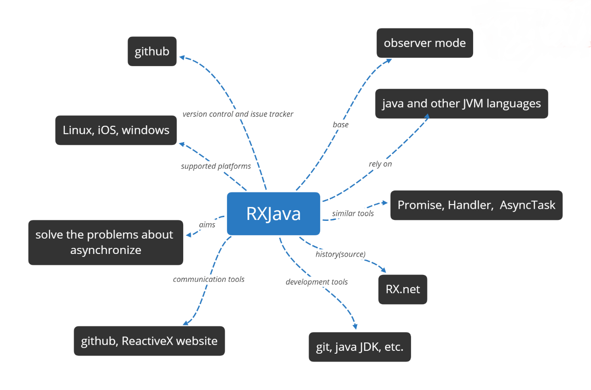
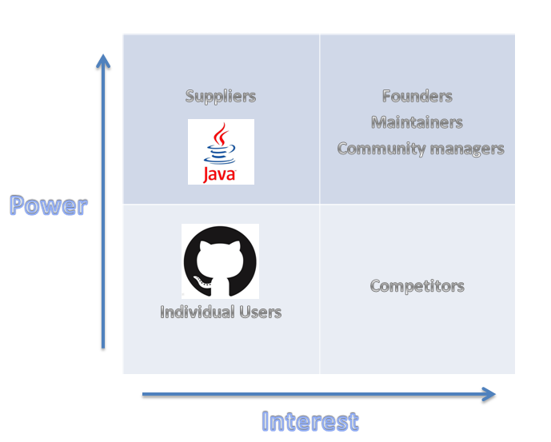

# Table of Content

- [Abstract](#abstract)
- [Introduction](#introduction)
- [Context View](#context-view)
  * [Base](#base)
  * [Communication Tools](#communication-tools)
  * [Rely](#rely)
  * [Development Tools](#development-tools)
- [Stakeholder Analysis](#stakeholder-analysis)
  * [Power/Interest Grid](#powerinterest-grid)
- [Development View](#development-view)
  * [Modules Structure](#modules-structure)
  * [Common Processing](#common-processing)
  * [Standardization of Design](#standardization-of-design)

# Abstract

RxJava is a Java based extension of ReactiveX. ReactiveX is a project which aims to provide reactive programming concept to various programming languages. Reactive Programming refers to the scenario where program reacts as and when data appears. It is a event based programming concept and events can propagate to registers observers. As per the Reactive, they have combined the best of Observer pattern, Iterator pattern and functional pattern. The Observer pattern done right. ReactiveX is a combination of the best ideas from the Observer pattern, the Iterator pattern, and functional programming. It aim to solve the problems about asynchronization. But actually, many users said that it was a little difficult to conquer this tool. There are also some users said it was really convenient when you have a deep understanding of this tool.

# Introduction

RxJava – Reactive Extensions for the JVM – a library for composing asynchronous and event-based programs using observable sequences for the Java VM. ReactiveX is a library for composing asynchronous and event-based programs by using observable sequences.

It extends the observer pattern to support sequences of data and/or events and adds operators that allow you to compose sequences together declaratively while abstracting away concerns about things like low-level threading, synchronization, thread-safety, concurrent data structures, and non-blocking I/O. 

RxJava was originally created by its development team in 2007, and its developers developed a project in the second half of 2009, The project was a financial services application that started off life as a Silverlight project then expanded into an integration project. The developers used Rx everywhere; client side in Silverlight 3/4, and server side in .NET 3.5/4.0. They were finding bugs in the early releases and posting proposed fixes to the guys at Microsoft. They were constantly updating to the latest version. It cost the project to be early adopters, but in time the payment was worth it. Rx allowed people to massively simplify an application that was inherently asynchronous, highly concurrent and targeted low latencies. Similar workflows that you had written in previous projects were pages of code long, now with Rx were several lines of LINQ. Trying to test asynchronous code on clients (WPF/Win Forms/Silverlight) was a constant challenge, but Rx solved that too.

This chapter gives a structured overview of RxJava by providing descriptions of the various parts that compose its architecture, in order to explain the system and how it works.

# Context View

The context view shows the different relations, dependencies and interactions RXJava has with its environment. Important for the context view are the people, systems and external entities with which system interacts. The context view can be seen in the following figure and the relationship is explained following the figure.

In order to understand this context model of RXJava, some of the external entities are explained.

## Base

RXJava is the extension of observer mode. Sometimes we say RXJava is observable. There are two key types to understand when working with Rx: Observable represents any object that can get data from a data source and whose state may be of interest in a way that other objects may register an interest. An observer is any object that wishes to be notified when the state of another object changes. An observer subscribes to an Observable sequence. The sequence sends items to the observer one at a time. The observer handles each one before processing the next one. If many events come in asynchronously, they must be stored in a queue or dropped. In Rx, an observer will never be called with an item out of order or called before the callback has returned for the previous item.

## Communication Tools

RXJava uses Github and Git	for version control	to help developers collaborate and track issues related	to this library.	Contributions	in the repository come from the	RXJava development	team, as	well	as from the open-source community. In order to stay in contact with	developers and users the following communication	tools are	used: github and official website. 

## Rely

RXJava support java 6 or later version as well as its JVM languages such as Groovy, Clojure, JRuby, Kotlin. It aims to respect the customs of each kind of language. RXJava is reactive extensions for the JVM, which means it is a library for composing asynchronous and event-based programs using observable sequences for the java VM.

## Development Tools

If you want to update this library, you will feel much easier when you use Git to do the version control. What's more, because of this library is designed based on JVM, it will make your life easier if you use the following tools: Java JDK.

# Stakeholder Analysis

This section identifies the key stakeholders of RxJava and describes how they apply to the project. This will be followed by an analysis of their influence and associated levels of power and interest.

| Type | Stakeholders | Description |
| --- | --- | --- |
| Developers | Core developers, Collaborators, Any developers on GitHub | Core developers and Collaborators are actively involved in the development, maintenance and documentation of the project. They are also responsible for reviewing issues and merging pull requests from other Collaborators and GitHub users. |
| Testers | Core developers and external contributors | They test RxJava for quality and compliance and give results accordingly. They responsible for internally running the automated tests of RxJava’s testing framework. |
| Acquirers | RxJava Foundation | The foundation determines the business and technical direction of RxJava and is responsible for governance, marketing and sales. |
| Communicators | Developers and the community | GitHub is a major online platform where communicators can interact with other stakeholders, and where developers can communicate with acquisitors and other developers about issues and Suggestions for source code changes. |
| Assessors | Core developers | Assessors are stakeholders that oversee the system’s conformance to standards and legal regulation. |
| Maintainers | Developers and the community | They make decisions about the progress of the project and are responsible for all maintenance tasks. |
| Support | Collaborators | Collaborators support the development of RxJava by helping users and novice contributors. |
| Users | Learners and programmers | These users use RxJava to learn about programming or to help them program. |

## Power/Interest Grid

The following figure provides a Power/Interest grid view of the RxJava stakeholders. It classifies stakeholders according to their interest in the system and their power to influence the development of the system. Such a classification can help identify the stakeholders that have the greatest impact on the system so that their interests can be prioritized.

FIGURE 1: POWER/INTEREST GRID

# Development View

This particular view highlights the concerns and interests of the developers and testers of the project. The different modules in the project have been identified, the file structure has been researched and important standardizations of processes are discussed.

## Modules Structure

The top layer division can be seen in *Figure 2*. Consider the actual situation, the RxJava Core and the RxJava Plugins almost surely rely on different external dependencies, since the developers of RxJava Core and RxJava Plugins may not be the same groups of people, and plugins will implement lots of features which RxJava Core does not. (That’s why it is called plugins.) The plugins are dependent on the plugin interface provided by RxJava Core to connect to the core modules. The RxJava plugin interface provides a utility class for RxJava plugin developers to inject handlers into certain standard RxJava operations. All three of these different components (RxJava Core, RxJava Plugins and External Dependencies) are assembled into the final released RxJava library. Finally, the RxJava Core also has internal dependencies which will be discussed next.

FIGURE 2: THE MODULE STRUCTURE VIEW OF RXJAVA

A more detailed view of modules in the source code of RxJava Core can be found in *Figure 3*. The main building blocks are the `Observables`, `Observers`, `Schedulers`, `Operators` and `Emitters` blocks, which are all used by other Java applications and/or libraries which incorporate the RxJava library. These five main components constitute the central public interface exposed by the RxJava library. 

For Observables, Observers, Operators and Emitters, they can be further divided into five main categories: `Flowable`, `Observable`, `Single`, `Completable` and `Maybe`. Each of which stands for different flowing properties and thus has its own strength and weaknesses. The core characteristic and distinctions between those five categories are shown in *Table 1*.  Note that the category Observable is different from RxJava Core’s building block Observables. RxJava Core’s building block Observables consists of the observables in call categories such as Flowable, Single, Completable or Maybe, not only observables in category Observable.

There is something confusing related to the naming conventions of classes in RxJava. The class which implements the observables of category Flowable, Observable, Single, Completable and Maybe are just called Flowable, Observable, Single, Completable and Maybe. (I believe it’s better to call them FlowableObservable, ObservableObservable, SingleObservable, CompletableObservable and MaybeObservable, as they all observables belongs to RxJava Core’s building block Observables. Although some class names such as ObservableObservable may sound a little bit weird, it reflects the real situation and is less confusing.)

For observers, operators and emitters belonging to those five main categories, the interfaces defining them are named much more reasonable. The interfaces are named in the form of ‘xxxyyy’ where ‘xxx’ stands for the category of the realized objects, which can be one of the words ‘Flowable, Observable, Single, Completable, or Maybe’, and ‘yyy’ represents the name of RxJava Core’s main building block where the realized objects live, which can be one of the words ‘Observer, Operator, or Emitter’. For instance, the class ‘MaybeObserver’ is the interface defining observers in category ‘Maybe’. There is one exception though: the interface defining observers in category ‘Flowable’ is not called ‘FlowableObserver’, instead, it is call ‘FlowableSubscriber’.

TABLE 1: THE CHARACTERISTICS OF THE MAIN FIVE CATEGORIES IN RXJAVA

| CATEGORY | CHARACTERISTICS |
| --- | --- |
| Flowable | 0.. N flows, supporting Reactive-Streams and backpressure |
| Observable | 0.. N flows, no backpressure |
| Single | A flow of exactly 1 item or an error |
| Completable | A flow without items but only a completion or error signal |
| Maybe | A flow with no items, exactly one item or an error |

Common processing parts, like `Util`, `Notification` and the RxJava `Plugin Interface`, are also used by the main blocks of source code. The behavior of source code in main blocks is annotated by `annotations` located in the annotations folder. Finally, all plugins are accessed through the RxJava plugin interface in order to work with the core source code by means of injecting handlers to certain standard RxJava core routines.

FIGURE 3: A MORE DETAILED VIEW AT THE SOURCE CODE OF RXJAVA CORE

## Common Processing

Just like any other large system, RxJava has separate code modules for tasks which are common to other modules. A few of RxJava’s commonly used modules have been identified in the [`internal/util`](src/main/java/io/reactivex/rxjava3/internal/util), [`core`](src/main/java/io/reactivex/rxjava3/core) and [`plugins`](src/main/java/io/reactivex/rxjava3/plugins) folder:

* A central, common Notification class is used. It is used to represent the reactive signal types: `onNext`, `onError` and `onComplete` and holds their parameter values (a value, a Throwable, or nothing).

* Moreover, multiple utilities are made by the team to be used throughout the project. In the [`internal/util`](src/main/java/io/reactivex/rxjava3/internal/util) folder, many utilities are listed, such as [`LinkedArrayList`](src/main/java/io/reactivex/rxjava3/internal/util/LinkedArrayList.java), [`AppendOnlyLinkedArrayList`](src/main/java/io/reactivex/rxjava3/internal/util/AppendOnlyLinkedArrayList.java), [`OpenHashSet`](src/main/java/io/reactivex/rxjava3/internal/util/OpenHashSet.java), and [`VolatileSizeArrayList`](src/main/java/io/reactivex/rxjava3/internal/util/VolatileSizeArrayList.java), which are all custom and fine-tuned data structures that be easily used by other modules and improve the efficiency of binaries and readability of source code.

* Because RxJava’s plugin interface provide a utility class to inject handlers to certain standard RxJava core operations, its should be considered as common process. Many core source code make use of the plugin interface wrapper function to make some core routines easily replaced by some third-party plugins developed by external developers. The `RxJavaPlugins` class provides the RxJava plugins developers the needed handlers to fine-tune the behavior of the RxJava library.

## Standardization of Design

Since RxJava is an open source library, everyone is free to contribute to the repository on GitHub. Seeing as multiple contributors are influencing RxJava, the core developers have standardized aspects of the design of the system to make it as maintainable, reliable and technically cohesive as possible. There is not a lot of information available about the general design of the platform, but the core developers have made some guidelines for new contributors to keep the overall code quality high and the licenses applicable. The most important aspects of contributing to RxJava are discussed in the [`CONTRIBUTING.MD`](CONTRIBUTING.MD) file:

* If some external developer would like to contribute code for RxJava, they can do so through GitHub by forking the repository and sending a pull request targeting the branch `3.x` which is the latest branch under active developing. 

* Contributors have to use git and have a GitHub account to be able to fork the Github repository [`ReactiveX/RxJava`](https://github.com/ReactiveX/RxJava)

* Use a text editor or IDE such as IntelliJ IDEA or Eclipse to make changes

* Optionally document changes in the RxJava documentation if it is necessary. (under [`docs`](docs) folder)

* Although not mentioned in [CONTRIBUTING.MD](CONTRIBUTING.MD), it is always necessary to write a solid commit message, explaining what has been done in the proposed changes.

* Before raising the first pull request, read the [`LICENSE`](LICENSE), and understand that by contributing the code, the external developers must agree to the license that all contributions are under the terms of the APLv2, and all files should be released with the Apache 2.0 license.

* If the external developers are adding a new file, the file should have a standard [`HEADER`](HEADER) where the copyright and license information are clearly stated.

* When submitting changes, the external developers should make every effort to follow existing coding conventions and styles in order to keep the code as readable as possible.

* Wait for their code to be reviewed by a RxJava core developer or other developers in the open source community.

The terminology, principles, contracts and other aspects of the design of RxJava v3 are documented in [`DESIGN.MD`](DESIGN.md). There are no concrete guidelines of using design patterns in the development of RxJava. However, as Reactive Extensions (ReactiveX) is a combination of the best ideas from the `Observer` pattern, the `Iterator` pattern, and `functional programming`, and RxJava is a Java VM implementation of ReactiveX, the RxJava library itself is indeed incorporating several good design patterns.

When examining the code, the `Builder` (the chain of operators applied to source observables are quite typical here), `Publish/Subscribe`, `Iterator` and `Lazy Initialization` design patterns have been identified. For example, the [`Flowable.java`](https://github.com/zhangchengkai826/RxJava/blob/sa-progress/src/main/java/io/reactivex/rxjava3/core/Flowable.java) and [`FlowableSubscriber.java`](src/main/java/io/reactivex/rxjava3/core/FlowableSubscriber.java) are two classes built according to the Publish/Subscribe design pattern.

The implementation workflow is flexible. Core RxJava developers are allowed to commit directly into the working branch (currently is branch `3.x`), other contributors have to use pull requests. These pull requests are labelled, reviewed and discussed by developers, and will be merged into the targeting branch if necessary.
