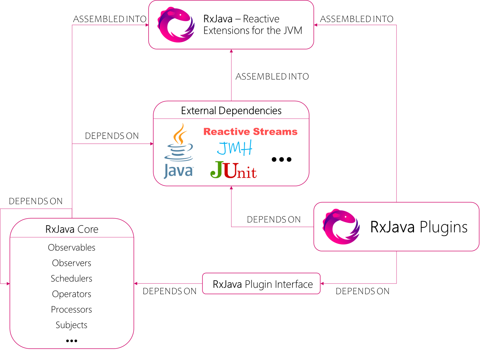
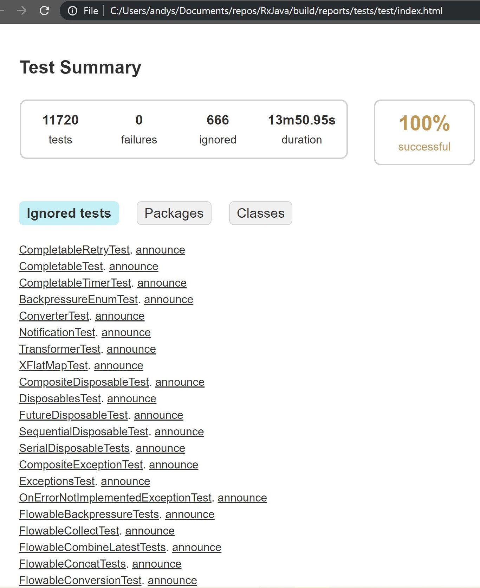

# Table of Content

- [Abstract](#abstract)
- [Introduction](#introduction)
- [Context View](#context-view)
  * [Base](#base)
  * [Communication Tools](#communication-tools)
  * [Rely](#rely)
  * [Development Tools](#development-tools)
- [Stakeholder Analysis](#stakeholder-analysis)
  * [Power/Interest Grid](#powerinterest-grid)
- [Development View](#development-view)
  * [Modules Structure](#modules-structure)
  * [Common Processing](#common-processing)
  * [Standardization of Design](#standardization-of-design)
  * [Standardization of Testing](#standardization-of-testing)
- [Technical Debt](#technical-debt)
  * [SonarQube Analysis](#sonarqube-analysis)
- [Deployment View](#deployment-view)
  * [Environment](#environment)
  * [The Choice Of Version](#the-choice-of-version)
  * [Denpendencies](#Dependencies)
- [Information View](#information-view)
  * [Observable and Subjects](#observable-and-subjects)
  * [Flowables and Processors](#flowables-and-processors)
  * [Completable Single and Maybe](#completable-single-and-maybe)
- [Evolution Perspective](#evolution-perspective)
  * [Version Replacement ](#version-replacement)
  * [Difference Analysis](#difference-analysis)
-[Conclusion](#conclusion)

# Abstract

RxJava is a Java based extension of ReactiveX. As you can see, RxJava is a kind of framework to help you finish the operations of asynchronize. What's more, it has made full use of the obervers pattern. It has a very excellent flexibility and expansibility. It aims to solve the problems about asynchronization. But actually, many users said that it was a little difficult to conquer this tool. There are also some users said it was really convenient when you have a deep understanding of this tool.

# Introduction

RxJava - the JVM's Reactive Extensions - a library for composing asynchronous and event-based programs using Java VM's observable sequences. ReactiveX is a library for composing asynchronous and event-based programs by using observable sequences.

It extends the observer pattern to support sequences of data and/or events, and adds operators that allow you to combine sequences declaratively, while abstracting for low-level threads, synchronization, thread safety, concurrent data structures, and non-blocking I/O.

RxJava was originally created by its development team in 2007, and its developers developed a project in the second half of 2009. The project is a financial services application, initially a Silverlight project, and then an integration project. Developers use Rx everywhere. Client in Silverlight 3/4 and server in.net 3.5/4.0. They found errors in earlier versions and released the recommended fix to Microsoft staff. They are constantly updated to the latest version. Being an early adopter has cost the project, but it's worth paying in time. Rx allows people to greatly simplify applications that are essentially asynchronous, highly concurrent, and targeted with low latency. Where you wrote workflow-like code page length in previous projects, using Rx now requires a few lines of LINQ.

This chapter gives a structured overview of RxJava by providing descriptions of the various parts that compose its architecture, in order to explain the system and how it works.

# Context View

The context view shows the different relations, dependencies and interactions RXJava has with its environment. Important for the context view are the people, systems and external entities with which system interacts. The context view can be seen in the following figure and the relationship is explained in the figure1.

FIGURE1 THE DESCRIPTION OF CONTEXT VIEW 

In order to understand this context model of RXJava, some of the external entities are explained.

## Base

RXJava is the extension of observer mode. So we also say RXJava is observable. Actually，this mode is very easy to understand. We have an observable and a subscriber. This mode can be described like this: a subscriber can subscrib an observable. For example, a switch can be an observable and a light can be the subscriber.  The light should observe the action of the switch and do the corresponding treatment, such as turn on or turn off the light. Actually, observer mode is just a frame. RxJava is based on this frame and in order to solve more complex problems, it has to work with various of operators and asynchronize operations.

## Communication Tools

RXJava uses Github and Git	for version control	to help developers collaborate and track issues related	to this library.	Contributions	in the repository come from the	RXJava development	team, as	well	as from the open-source community. In order to stay in contact with	developers and users the following communication	tools are	used: github and official website. 

## Rely

RXJava support java 6 or later version as well as its JVM languages such as Groovy, Clojure, JRuby, Kotlin. It aims to respect the customs of each kind of language. RXJava is reactive extensions for the JVM, which means it is a library for composing asynchronous and event-based programs using observable sequences for the java VM.

## Development Tools

If you want to update this library, you will feel much easier when you use Git to do the version control. What's more, because of this library is designed based on JVM, it will make your life easier if you use the following tools: Java JDK.


# Stakeholder Analysis

This section identifies the key stakeholders of RxJava and describes how they apply to the project. This will be followed by an analysis of their influence and associated levels of power and interest.

| Type | Stakeholders | Description |
| --- | --- | --- |
| Developers | Core developers, Collaborators, Any developers on GitHub | Core developers and Collaborators are actively involved in the development, maintenance and documentation of the project. They are also responsible for reviewing issues and merging pull requests from other Collaborators and GitHub users. |
| Testers | Core developers and external contributors | They test RxJava for quality and compliance and give results accordingly. They responsible for internally running the automated tests of RxJava’s testing framework. |
| Acquirers | RxJava Foundation | The foundation determines the business and technical direction of RxJava and is responsible for governance, marketing and sales. |
| Communicators | Developers and the community | GitHub is a major online platform where communicators can interact with other stakeholders, and where developers can communicate with acquisitors and other developers about issues and Suggestions for source code changes. |
| Assessors | Core developers | Assessors are stakeholders that oversee the system’s conformance to standards and legal regulation. |
| Maintainers | Developers and the community | They make decisions about the progress of the project and are responsible for all maintenance tasks. |
| Support | Collaborators | Collaborators support the development of RxJava by helping users and novice contributors. |
| Users | Learners and programmers | These users use RxJava to learn about programming or to help them program. |

## Power/Interest Grid

The following figure provides a Power/Interest grid view of the RxJava stakeholders. It classifies stakeholders according to their interest in the system and their power to influence the development of the system. Such a classification can help identify the stakeholders that have the greatest impact on the system so that their interests can be prioritized.


FIGURE 1: POWER/INTEREST GRID

The founders, maintainers, and community managers are the most important, directly determining the birth and development of the product. Suppliers are important on the influence scale because their opinions directly affect the direction of the product, but their interests are relatively low. Competitors, by contrast, have higher stakes and lower leverage. Beyond that are independent users and developers, who have little influence, no direct interest, and no significant role in RxJava development.

## Critical to Quality Attributes
<p>This section will focus on analyzing RxJava's critical to quality attributes from the perspective of various stakeholders and identifying the most important quality attributes for the project.</p>
<p>The following is some common quality attributes:</p>

### 1.Availability
<p>Availability is related to system failures and their associated consequences. System failures occur when the system no longer provides the services described in its specifications, and system users can observe such failures.</p>

### 2.Modifiability
<p>Whether a project is easy to request to add or remove changes to functionality, platform, quality attributes, or capacity</p>

### 3.Performance
<p>Performance is time dependent. When an event occurs, the system must respond to it. Time-arrival response has many characteristics, but performance is basically how long it will take the system to respond when an event occurs.</p>

### 4.Security
<p>Security is a measure of the system's ability to provide services to legitimate users while preventing unauthorized use</p>

### 5.Testability
<p>How easy it is to reveal software defects through testing</p>

### 6.Usability
<p>Usability is concerned with how easy it is for the user to accomplish a desired task and the kind of user support the system provides.</p>

### 7.Maintainability
<p>Maintainability indicates how easy it is to correct a defect or make a change in software.</p>

### 8.Portability
<p>Portability is a measure of the amount of work it takes to move a piece of software from one environment to another.</p>

### 9.Reusability
<p>From the perspective of the long-term goal of software development, reusability indicates the extent to which a software component can be used in other applications in addition to the system originally developed.</p>

### 10.Interoperability
<p>Interoperability indicates how easy it is for products to exchange data and services with other systems.</p>

### 11.Robustness
<p>Robustness refers to the degree to which a system or its components can continue to function correctly when confronted with illegal input data, defects or abnormal operation of related software or hardware components.</p>

### 12.Reliability
<p>Reliability is the probability that software will execute without failure for a period of time. Robustness and Availability can sometimes be seen as part of reliability.</p>
<p>&nbsp;</p>
<p>The following are requirements for different quality attributes of the product by different stakeholders</p>
<table>
<tbody>
<tr>
<td>
<p><strong>Type</strong></p>
</td>
<td>
<p><strong>Quality attributes of concern</strong></p>
</td>
<td>
<p><strong>Description</strong></p>
</td>
</tr>
<tr>
<td>
<p><strong>Developers</strong></p>
</td>
<td>
<p>Availability,</p>
<p>Performance,</p>
<p>Modifiability,</p>
<p>Testability,</p>
<p>Usability</p>
</td>
<td>
<p>the developers are actively involved in the development, maintenance and documentation of the project. So they are very concerned about availability, modifiability and performance.</p>
</td>
</tr>
<tr>
<td>
<p><strong>Testers</strong></p>
</td>
<td>
<p>Testability</p>
</td>
<td>
<p>They test RxJava for quality and compliance and give results accordingly. So they just need to focus on the testability of the product</p>
</td>
</tr>
<tr>
<td>
<p><strong>Acquirers</strong></p>
</td>
<td>
<p>Security,</p>
<p>Portability,</p>
<p>Reusability</p>
</td>
<td>
<p>The foundation determines the business and technical direction of RxJava and is responsible for governance, marketing and sales. Therefore, for them, product safety is particularly important</p>
</td>
</tr>
<tr>
<td>
<p><strong>Communicators</strong></p>
</td>
<td>
<p>Availability</p>
</td>
<td>
<p>The communicator's primary task is to interact with other stakeholders, so they are primarily concerned with the availability of the product</p>
</td>
</tr>
<tr>
<td>
<p><strong>Assessors</strong></p>
</td>
<td>
<p>Security</p>
</td>
<td>
<p>Assessors are stakeholders that oversee the system&rsquo;s conformance to standards and legal regulation. Clearly, they are concerned about product safety</p>
</td>
</tr>
<tr>
<td>
<p><strong>Maintainers</strong></p>
</td>
<td>
<p>Maintainability,</p>
<p>Portability,</p>
<p>Reusability,</p>
<p>Testability</p>
</td>
<td>
<p>They make decisions about the progress of the project and are responsible for all maintenance tasks. So product&rsquo;s maintainability is very important to them</p>
</td>
</tr>
<tr>
<td>
<p><strong>Support</strong></p>
</td>
<td>
<p>Availability</p>
</td>
<td>
<p>Collaborators support the development of RxJava by helping users and novice contributors. They just need to focus on availability.</p>
</td>
</tr>
<tr>
<td>
<p><strong>Users</strong></p>
</td>
<td>
<p>Availability,</p>
<p>Performance,</p>
<p>Interoperability,</p>
<p>Reliability,</p>
<p>Robustness</p>
</td>
<td>
<p>These users use RxJava to learn about programming or to help them program. They pay close attention to the performance of the product, This directly determines whether they will choose to use the product.</p>
</td>
</tr>
</tbody>
</table>
<p>Combining the above analysis, we can obtain some critical to quality attributes of RxJava:</p>

### 1.Availability
<p>&nbsp;&nbsp;&nbsp;&nbsp;&nbsp;&nbsp; Both developers and users are concerned about the availability of the product, &nbsp;As a Java library, no one wants it to be unavailable.</p>

### 2.Performance&amp; Usability
<p>&nbsp;&nbsp;&nbsp;&nbsp;&nbsp;&nbsp; RxJava&rsquo;s performance and usability are important because these directly determine whether users will choose to use RxJava or not. As a tool to implement asynchrony, one of the best things people can expect from it is that it can simplify the work of programming and have high performance.</p>

### 3.Modifiability&amp; Reusability
<p>&nbsp;&nbsp;&nbsp;&nbsp;&nbsp;&nbsp; Modifiability and reusability determine whether the product is easy and robust to develop, which is important for an open source project.</p>

# Development View

This particular view highlights the concerns and interests of the developers and testers of the project. The different modules in the project have been identified, the file structure has been researched and important standardizations of processes are discussed.

## Modules Structure

The top layer division can be seen in *Figure 2*. Consider the actual situation, the RxJava Core and the RxJava Plugins almost surely rely on different external dependencies, since the developers of RxJava Core and RxJava Plugins may not be the same groups of people, and plugins will implement lots of features which RxJava Core does not. (That’s why it is called plugins.) The plugins are dependent on the plugin interface provided by RxJava Core to connect to the core modules. The RxJava plugin interface provides a utility class for RxJava plugin developers to inject handlers into certain standard RxJava operations. All three of these different components (RxJava Core, RxJava Plugins and External Dependencies) are assembled into the final released RxJava library. Finally, the RxJava Core also has internal dependencies which will be discussed next.



FIGURE 2: THE MODULE STRUCTURE VIEW OF RXJAVA

A more detailed view of modules in the source code of RxJava Core can be found in *Figure 3*. The main building blocks are the `Observables`, `Observers`, `Schedulers`, `Operators` and `Emitters` blocks, which are all used by other Java applications and/or libraries which incorporate the RxJava library. These five main components constitute the central public interface exposed by the RxJava library. 

For Observables, Observers, Operators and Emitters, they can be further divided into five main categories: `Flowable`, `Observable`, `Single`, `Completable` and `Maybe`. Each of which stands for different flowing properties and thus has its own strength and weaknesses. The core characteristic and distinctions between those five categories are shown in *Table 1*.  Note that the category Observable is different from RxJava Core’s building block Observables. RxJava Core’s building block Observables consists of the observables in call categories such as Flowable, Single, Completable or Maybe, not only observables in category Observable.

There is something confusing related to the naming conventions of classes in RxJava. The class which implements the observables of category Flowable, Observable, Single, Completable and Maybe are just called Flowable, Observable, Single, Completable and Maybe. (I believe it’s better to call them FlowableObservable, ObservableObservable, SingleObservable, CompletableObservable and MaybeObservable, as they all observables belongs to RxJava Core’s building block Observables. Although some class names such as ObservableObservable may sound a little bit weird, it reflects the real situation and is less confusing.)

For observers, operators and emitters belonging to those five main categories, the interfaces defining them are named much more reasonable. The interfaces are named in the form of ‘xxxyyy’ where ‘xxx’ stands for the category of the realized objects, which can be one of the words ‘Flowable, Observable, Single, Completable, or Maybe’, and ‘yyy’ represents the name of RxJava Core’s main building block where the realized objects live, which can be one of the words ‘Observer, Operator, or Emitter’. For instance, the class ‘MaybeObserver’ is the interface defining observers in category ‘Maybe’. There is one exception though: the interface defining observers in category ‘Flowable’ is not called ‘FlowableObserver’, instead, it is call ‘FlowableSubscriber’.

TABLE 1: THE CHARACTERISTICS OF THE MAIN FIVE CATEGORIES IN RXJAVA

| CATEGORY | CHARACTERISTICS |
| --- | --- |
| Flowable | 0.. N flows, supporting Reactive-Streams and backpressure |
| Observable | 0.. N flows, no backpressure |
| Single | A flow of exactly 1 item or an error |
| Completable | A flow without items but only a completion or error signal |
| Maybe | A flow with no items, exactly one item or an error |

Common processing parts, like `Util`, `Notification` and the RxJava `Plugin Interface`, are also used by the main blocks of source code. The behavior of source code in main blocks is annotated by [`annotations`](src/main/java/io/reactivex/rxjava3/annotations) located in the annotations folder. Finally, all plugins are accessed through the RxJava plugin interface in order to work with the core source code by means of injecting handlers to certain standard RxJava core routines.


FIGURE 3: A MORE DETAILED VIEW AT THE SOURCE CODE OF RXJAVA CORE

## Common Processing

Just like any other large system, RxJava has separate code modules for tasks which are common to other modules. A few of RxJava’s commonly used modules have been identified in the [`internal/util`](src/main/java/io/reactivex/rxjava3/internal/util), [`core`](src/main/java/io/reactivex/rxjava3/core) and [`plugins`](src/main/java/io/reactivex/rxjava3/plugins) folder:

* A central, common Notification class is used. It is used to represent the reactive signal types: `onNext`, `onError` and `onComplete` and holds their parameter values (a value, a Throwable, or nothing).

* Moreover, multiple utilities are made by the team to be used throughout the project. In the [`internal/util`](src/main/java/io/reactivex/rxjava3/internal/util) folder, many utilities are listed, such as [`LinkedArrayList`](src/main/java/io/reactivex/rxjava3/internal/util/LinkedArrayList.java), [`AppendOnlyLinkedArrayList`](src/main/java/io/reactivex/rxjava3/internal/util/AppendOnlyLinkedArrayList.java), [`OpenHashSet`](src/main/java/io/reactivex/rxjava3/internal/util/OpenHashSet.java), and [`VolatileSizeArrayList`](src/main/java/io/reactivex/rxjava3/internal/util/VolatileSizeArrayList.java), which are all custom and fine-tuned data structures that be easily used by other modules and improve the efficiency of binaries and readability of source code.

* Because RxJava’s plugin interface provide a utility class to inject handlers to certain standard RxJava core operations, its should be considered as common process. Many core source code make use of the plugin interface wrapper function to make some core routines easily replaced by some third-party plugins developed by external developers. The [`RxJavaPlugins`](src/main/java/io/reactivex/rxjava3/plugins/RxJavaPlugins.java) class provides the RxJava plugins developers the needed handlers to fine-tune the behavior of the RxJava library.


## Standardization of Design

Since RxJava is an open source library, everyone is free to contribute to the repository on GitHub. Seeing as multiple contributors are influencing RxJava, the core developers have standardized aspects of the design of the system to make it as maintainable, reliable and technically cohesive as possible. There is not a lot of information available about the general design of the platform, but the core developers have made some guidelines for new contributors to keep the overall code quality high and the licenses applicable. The most important aspects of contributing to RxJava are discussed in the [`CONTRIBUTING.MD`](CONTRIBUTING.MD) file:

* If some external developer would like to contribute code for RxJava, they can do so through GitHub by forking the repository and sending a pull request targeting the branch `3.x` which is the latest branch under active developing. 

* Contributors have to use git and have a GitHub account to be able to fork the Github repository [`ReactiveX/RxJava`](https://github.com/ReactiveX/RxJava)

* Use a text editor or IDE such as IntelliJ IDEA or Eclipse to make changes

* Optionally document changes in the RxJava documentation if it is necessary. (under [`docs`](docs) folder)

* Although not mentioned in [`CONTRIBUTING.MD`](CONTRIBUTING.MD), it is always necessary to write a solid commit message, explaining what has been done in the proposed changes.

* Before raising the first pull request, read the [`LICENSE`](LICENSE), and understand that by contributing the code, the external developers must agree to the license that all contributions are under the terms of the APLv2, and all files should be released with the Apache 2.0 license.

* If the external developers are adding a new file, the file should have a standard [`HEADER`](HEADER) where the copyright and license information are clearly stated.

* When submitting changes, the external developers should make every effort to follow existing coding conventions and styles in order to keep the code as readable as possible.

* Wait for their code to be reviewed by a RxJava core developer or other developers in the open source community.

The terminology, principles, contracts and other aspects of the design of RxJava v3 are documented in [`DESIGN.MD`](DESIGN.md). There are no concrete guidelines of using design patterns in the development of RxJava. However, as Reactive Extensions (ReactiveX) is a combination of the best ideas from the `Observer` pattern, the `Iterator` pattern, and `functional programming`, and RxJava is a Java VM implementation of ReactiveX, the RxJava library itself is indeed incorporating several good design patterns.

When examining the code, the `Factory` (the chain of operators applied to source observables are quite typical here), `Publish/Subscribe`, `Iterator` and `Singleton` design patterns have been identified. For example, the [`Flowable.java`](https://github.com/zhangchengkai826/RxJava/blob/sa-progress/src/main/java/io/reactivex/rxjava3/core/Flowable.java) and [`FlowableSubscriber.java`](src/main/java/io/reactivex/rxjava3/core/FlowableSubscriber.java) are two classes built according to the Publish/Subscribe design pattern.


The implementation workflow is flexible. Core RxJava developers are allowed to commit directly into the working branch (currently is branch `3.x`), other contributors have to use pull requests. These pull requests are labelled, reviewed and discussed by developers, and will be merged into the targeting branch if necessary.

## Standardization of Testing

By standardising the test methods, technologies and conventions, the overall testing process remains consistent and has a higher pace. In this section, RxJava’s efforts to achieve this are reviewed.

The RxJava project uses `Gradle` build tool as its build tool of choice. The build script in [`build.gradle`](build.gradle) will initiates all tests and set up global settings for the test process. All new contributions provided by developers need to include two things in terms of testing. First of all, it needs to provide new unit tests, using the `JUnit` framework for any novel logic introduced. In addition, performance test and benchmarks using `JMH` (Java Microbenchmark Harness) for the new bug fixes or features should also be provided, in order to identify possible performance degradation at first spot.

Afterwards, when the developers finish their code changes and provided all the necessary tests and benchmarks, they could raise pull request in Github in order to get their contribution known and reviewed by others. RxJava uses `Travis CI` (a hosted continuous integration service used to build and test software projects hosted at GitHub) to automatically check the contributions' validity by auto rebuild the whole project in the platform provided by Travis CI.

Whenever a pull request is opened on GitHub, Travis CI might auto rebuild the project and updates the status icon on home page of the project in Github indicating whether the build is successful. The projec manager can use it to decide whether to merge this pull request. If the build process failed, the pull request will almost surely be closed by the community and the code changes will never get merged into project's main working branch, since if it is merged, it will make the whole project unbuildable.

When Travis CI rebuild the project in order to check a pull request's validity, besides the final result indicating build success or failure, it also provides complete logs of the whole build process. As a example, a build log provided by Travis CI for a RxJava pull request is presented below.


The build log provided by Travis CI can help pull request owners quickly identify the reasons causing the build failure. The developers can use the log to identify the problems in order to fix the program properly and then re-raise the pull request.

On Windows Verion 10.0.17763 with Java 1.8 Update 191, 11720 tests have been passed successfully.



Finally, developers' pull requests are only merged into the project main working branch when the Travis CI build succeeds, the tests are all passed and new test material is properly provided and reviewed. Complex changes will be tested more thoroughly in different environments and levels to assure quality.

# Technical Debt

This section focuses on the technical and testing debt present inside the RxJava project. The definition of technical debt according to Techopedia is:

> Technical debt is a concept in programming that reflects the extra development work that arises when code that is easy to implement in the short run is used instead of applying the best overall solution. 

In other words, technical debt is the total time the developer team needs to pay in order to make the software project perfect.

## SonarQube Analysis

SonarQube is a platform for continuous software quality monitoring. This platform is able to analyse a large software project like RxJava in a matter of minutes. It provides the user with crucial insights about bugs, security and technical debt within the project. Running the SonarQube analysis tool on the `sa-progress` branch version of RxJava (based on `3.x` main working branch) in Github has given the following insights about technical debt. 

SonarQube reports several bugs (`119`), vulnerabilities (`only 5`!) and code smells (`3345`), ranging from `defining a constant instead of duplicating the same literal for lots of times` to `Define a constant instead of duplicating this literal "sources is null" 10 times` to `several duplicated blocks of code could be removed` (RxJava has `1757` duplicated code blocks in `1609` different files, and there are `17.2%` code are identical in the entire code base, which is obviously not a small number). 

Among all the 119 indicated bugs reported by SonarQube, `54` of them are major faults. So it seems that half of the bugs reported are necessary to fix. The other 65 bugs are labeled minor, which does not affect the main funtionalities of the RxJava library. They might be dealed with in the future when all major bugs are fixed.

The key analysis results are summerized in the following table, where all the key attributes' meanings are well documented.

| Attribute Name | Value | Description | Related Quality Attribute |
| -- | -- | -- | -- |
| Bugs | 119 | A coding error that will break the code and needs to be fixed immediately | Reliability |
| Vulnerabilities | 5 | Code that can be exploited by hackers | Security |
| Security Hotspots | 0 | Security-sensitive code that requires manual review to assess whether or not a vulnerability exists | Security |
| Debt | 172d | The estimated time it will take to fix all Code Smells | Maintainability |
| Code Smells | 3.3k | Code that is confusing and difficult to maintain | Maintainability |
| Coverage | 98.6% | The percentage of lines of code covered by tests | Coverage |
| Unit Tests | 11k | Tests that ensure your code is working properly | Coverage |
| Duplications | 17.2% | Identical lines of code | Duplication |
| Duplicated Blocks | 1.8k | The number of duplicated blocks of lines of code | Duplication |

The technical debt analysis provides a very good insight into RxJava project. SonarQube uses the SQALE methodology, which is a method to support the evaluation of source code independent of language or code analysis tools. The resulting findings include `172` days worth of technical debt. The maintainability rating of RxJava project is the highest possible rate, namely an `A`. An overview visualisation of the maintainability of RxJava project is presented below.


In the above figure, each bubble represents a source code file (.java). The closer a bubble's color is to red, the higher the ratio of technical debt of that source code file is, which means the maintainability of that source code file are worse. 

The technical debt ratio is computed as `technical debt (unit: minutes) / estimated development cost (unit: minutes)`. By default, the estimated development cost is computed as `total lines of code * 30 minutes`. The higher technical debt ratio is, the harder to maintain the corresponding code.

Bubble size indicates code smell volume (The larger a bubble is, the more code smells exist in the corresponding source code file), and each bubble's vertical position reflects the estimated time to fix the code smells in the corresponding source code file. Small green bubbles on the bottom edge are best, since it means the corresponding source code file has few code smells and is easy to maintain.

# Deployment View

The deployment view is what is the environment of RxJava. It will show the hidden dependencies while using RxJava, it's hardware and software environment and lastly the required knowledge for it.

## Environment
At this point in time, RxJava used some special points from Java8, so in order to use it, you must have the support of Java8. However, if you don not want to use Java8, you can use JDK of other versions. But you need some extra configuration. As for the development environment, any IDE which can run the Java laguage is able to support RxJava. As a result, eclipse, IDEA and other efficient IDEs all work well.

## The Choice Of Version
Apart from that, now RxJava has 2 versions, 1.X and 2.X. The difference between them is that the first version is more stable. The second version has added some new design method and used some new APIs. If you want to learn RxJava, we suggest that you use the stable version.

## Dependencies
As for RxJava, it doesn't have lots of demandings for hardware, but for softwares, it need to implement a lot of libraries, such like this:
```
    implementation 'io.reactivex.rxjava2:rxandroid:2.0.2'
    implementation 'io.reactivex.rxjava2:rxjava:2.0.2'
    implementation 'com.squareup.retrofit2:retrofit:2.0.2'
    implementation 'com.squareup.retrofit2:adapter-rxjava2:2.3.0'
    implementation 'com.squareup.retrofit2:converter-gson:2.0.2'
    //butterknife的依赖
    implementation 'com.jakewharton:butterknife:8.8.1'
    annotationProcessor 'com.jakewharton:butterknife-compiler:8.8.1'
    //retrofit与rxjava和rxandroid2.x.y版本的依赖
    implementation 'io.reactivex.rxjava2:rxandroid:2.0.2'
    implementation 'io.reactivex.rxjava2:rxjava:2.0.2'
    implementation 'com.squareup.retrofit2:retrofit:2.0.2'
    implementation 'com.squareup.retrofit2:adapter-rxjava2:2.3.0'
    implementation 'com.squareup.retrofit2:converter-gson:2.0.2'
    //dagger2的依赖
    implementation 'com.google.dagger:dagger:2.14.1'
    annotationProcessor 'com.google.dagger:dagger-compiler:2.14.1'
    implementation 'com.lzy.net:okgo:3.0.4'
```

# Information View

We define the information view as a description of the way that an architecture stores, manipulates, manages and distributes the data of the system. 

 As we learned from the development view,  RxJava core consists of some key building blocks: observables, observers, operators and emitters. For  RxJava, it is not an information system, so in this part, we mainly talk about the **data flow** in the objects that can be observed. 

These objects can be divided into two parts——endless observables and just one element. Below are the some details.

## Observable and Subjects

### PublishSubject

It just takes items from one observable and diverts them to another. But it **doesn’t cache any event**, so notifications about past elements aren’t forwarded to each new observer. When the PublishSubject emits an error, all the subscribers are notified and won’t receive anything more.

### ReplaySubject

This Subject replays events to **current and late** observers.  Each new subscriber is getting all the elements emitted by the parent. 

### BehaviorSubject

This subject caches **the most recent value** emitted. When we have a configuration change  we usually lose the subscription and we have to resubscribe to it. Thanks to the BehaviorSubject, we’ll have the most recent data without needing to get new data.

### AsyncSubject

This subject caches **the last event** emitted and sends it to the observers only when an *onComplete* event is emitted. AsyncSubject requires completion before sending the last object to the observers. That means that, in any case, it can be an endless data flow observable.

## Flowables and Processors

 Flowables are like observables but they support **backpressure**.  And a backpressure strategy indicates what to do with emitted items if they can’t be processed as fast as they are received. And the available options contain:

### Drop

**Ignore** all the streamed items that can’t be processed until downstream can accept more of them. 

### Buffer

Creates **a bounded or unbounded buffer** that holds the emitted items that couldn’t be processed by the downstream. Notice that if we set a bounded buffer it can lead to a backpressure exception as we can overflow its bounds.

### Latest

This is the last strategy. It’s similar to the drop strategy but it keeps the last emitted item. Unlike drop, it ensures that at least one element is retained.

## Completable Single and Maybe

### Single

A **Single** is an observable that only emits one item and then completes. The single ensures that one item will be sent.

+  **onError**:  called whenever an error is thrown in some point of the stream. 

+  **onSuccess**:  called if we get a response from the stream, in this case information about the user and we use a **Single** because we know 100% that a user has information to show. 

### Maybe  

It only emits one item and then completes and can complete without emitting a value.  

- **onError**: called whenever an error is thrown in some point of the stream.
- **onSuccess** : called if we get a response from the stream
- **onComplete** : called if we have an empty output

### Completable

It is  the last of the trio and it just broadcasts a complete event .

- **onError** : called whenever an error is thrown at some point of the stream or if, in this case, we couldn’t perform the login for some reason.
- **onComplete** : called if everything went right. In this case we don’t have any output, just a code block that will be invoked afterwards.

Above are all the data flow in the objects that can be observed. 
# Evolution Perspective

RxJava is a Java VM implementation of Reactive Extensions: a library for composing asynchronous and event-based programs by using observable sequences.

##  Version Replacement 

Through out the years, RxJava has evolved a lot. And up to now, it has already 221 releases, starting from **February 5th, 2013**. It now has three versions, and the first version 1.x  is end-of-life as of **March 31, 2018**. And they have stopped adding new features to the second version 2.x, only fixing some bugs until  **December 31, 2020**.  And the version 3.x was first released on  **June 25th, 2019**.

## Difference Analysis

All versions of RxJava can be found on the GitHub repository. Compared with 1.x, Version 2.x had changed a lot especially at **API**, although the ideas of using are almost the same. It has been completely rewritten from scratch on top of the Reactive-Streams specification. The specification itself has evolved out of RxJava 1.x and provides a common baseline for reactive systems and libraries.

### Changes from 1.x to 2.x

+  Single dependency: **Reactive Streams**

     RxJava 2.0 has been completely **rewritten** from scratch on top of the **Reactive-Streams** specification, while the 1.x is **zero dependency**.

+ **API** changes

    RxJava 2.0 provides more user-friendly API and many have changed a lot. 

   + It continued to support for Java 6+ and Android 2.3+
   + Its performance of design kept increasing 
   + It support Java 8 lambda-friendly API.
   + It became non-opinion about source of concurrency.

### Changes from 2.x to 3.x

As for Version 3.x, it continue to support for Java 6+ and Android 2.3+ and does not change a lot. The changes are as follows:

+ API signature changes

    It fixed API mistakes and many limits of RxJava 2.

+ Standardized operators

    It is the same as 2.x, and for the 3.x version has just released and doesn't    has a lot explanations, some details can not be affirm.

+ Operator behavior changes

# Conclusion
